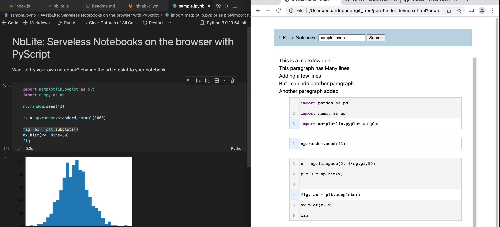

# NBLite: Minimalistic ClientSide Notebooks

A fork of: https://eduardobonet.gitlab.io/nblite/ for educational purposes.

一个用于学习Python的Fork, 原始仓库地址:https://eduardobonet.gitlab.io/nblite/ , 如果你也打算使用这个仓库, 请保留原作者的信息, 原作者为Euardo Bonet. 谢谢.

相关Python3学习资料:[生信Python3极简教程](https://py.nieyuqi.cn)

NBLite is a proof of concept that creates a client side runnable version of a notebook, adding minimal styling and content, with the goal of exploring PyScript.

NBLite parses a notebook, creates the HTML, identifies the dependencies with 60 lines of javascript.

## TODO

- [ ] Custom pyenv paths 
- [ ] Just show the scripts instead of using a repl
- [ ] Styling injection
- [ ] Add repl for exploration
- [ ] Lines should continue
- [ ] Better output support (plt.plot(x,y) for example)

### Consideration
If you use this project, please credit it back to the original author, Euardo Bonet.

## Opening local files

To open a notebook locally, you will need to run your browser with CORS disabled:

- [Instruction on opening Chrome without CORS](https://stackoverflow.com/questions/3102819/disable-same-origin-policy-in-chrome)